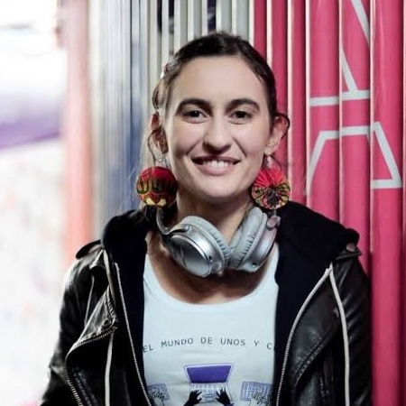
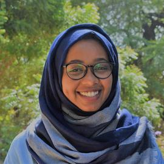
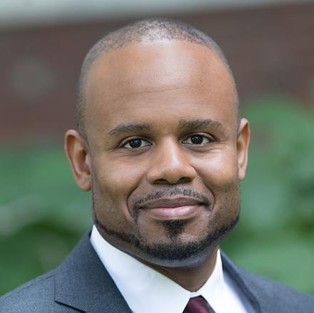
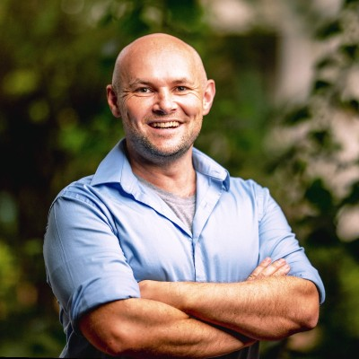

### Organizing Committee Members 

|:-:|:-:|:-:|:-:|
|||||
|:-:|:-:|:-:|:-:|
| [Celia Cintas](https://research.ibm.com/people/celia-cintas) | [Siobhan Mackenzie Hall](https://oxfordcharacter.org/student/siobhan) | [John Wamburu](https://research.ibm.com/people/john-wamburu) | [Aisha Alaagib](https://aishaalaagib.netlify.app/) |
|:-:|:-:|:-:|:-:|
| IBM Research | University of Oxford | IBM Research | German Research Center   for Artificial Intelligence |

 

### Advisors

|:-:|:-:|:-:|:-:|
||||
|:-:|:-:|:-:|:-:|
| [Edward McFowland III](https://www.hbs.edu/faculty/Pages/profile.aspx?facId=772797) | [Ina Fiterau Brostean](https://www.cics.umass.edu/people/fiterau-brostean-ina) | [Skyler Speakman](https://research.ibm.com/people/skyler-speakman) |
|:-:|:-:|:-:|:-:|
| Harvard Business School | University of Massachusetts Amherst | IBM Research |
